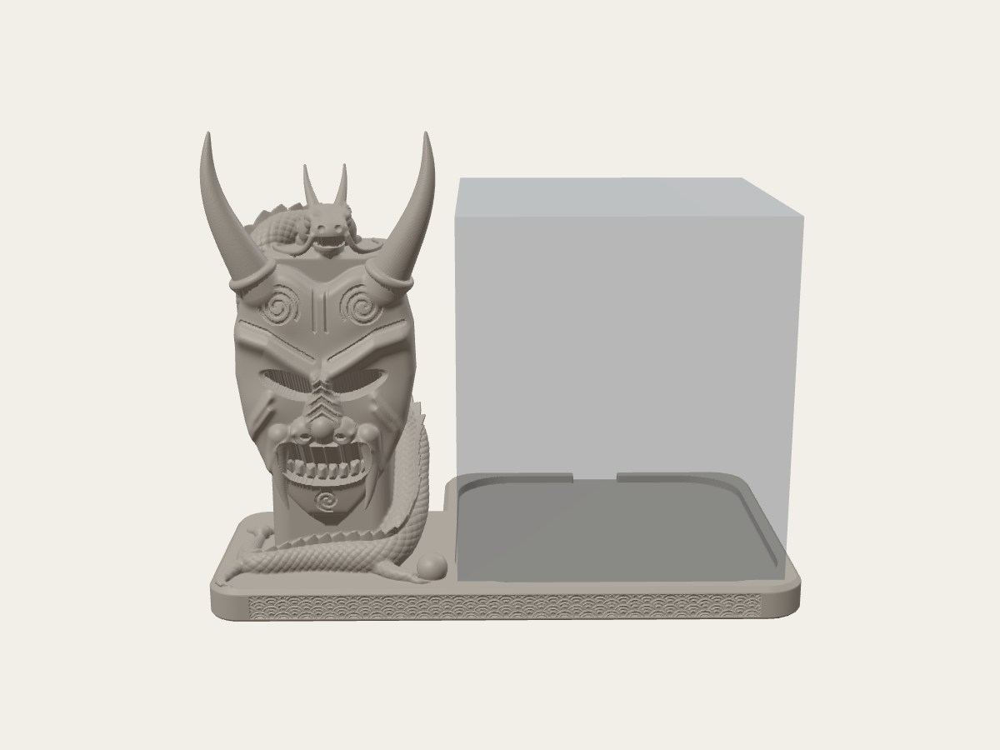
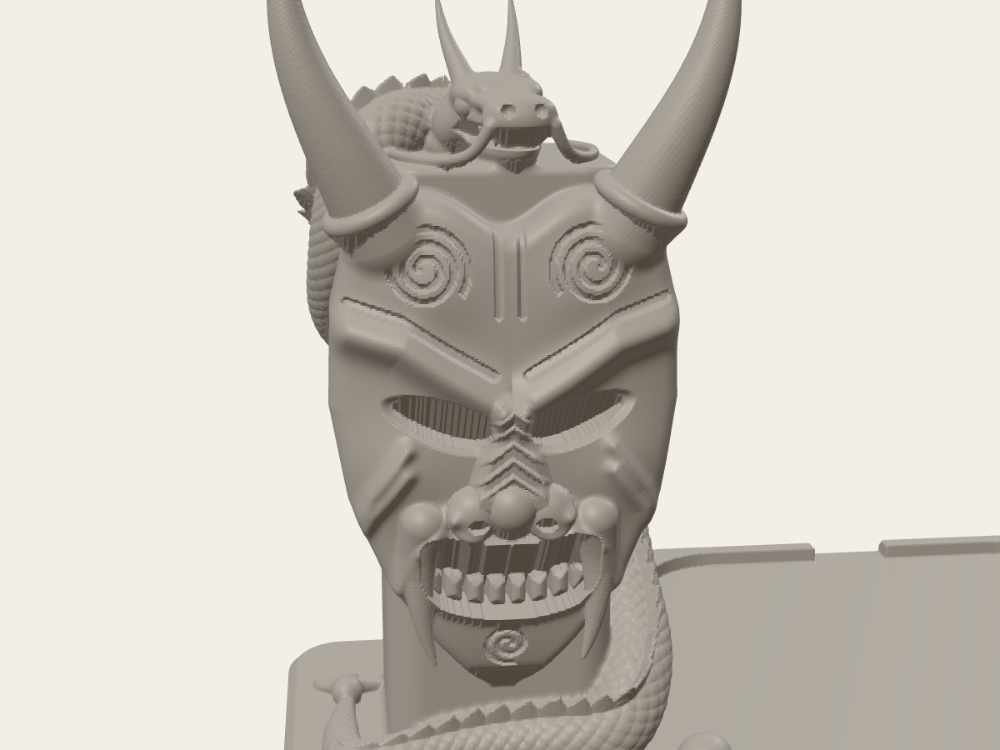
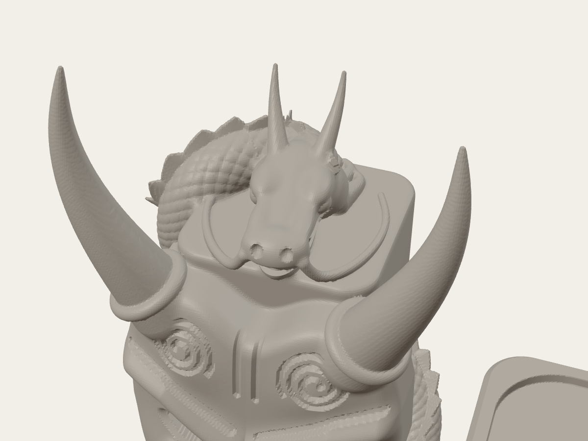
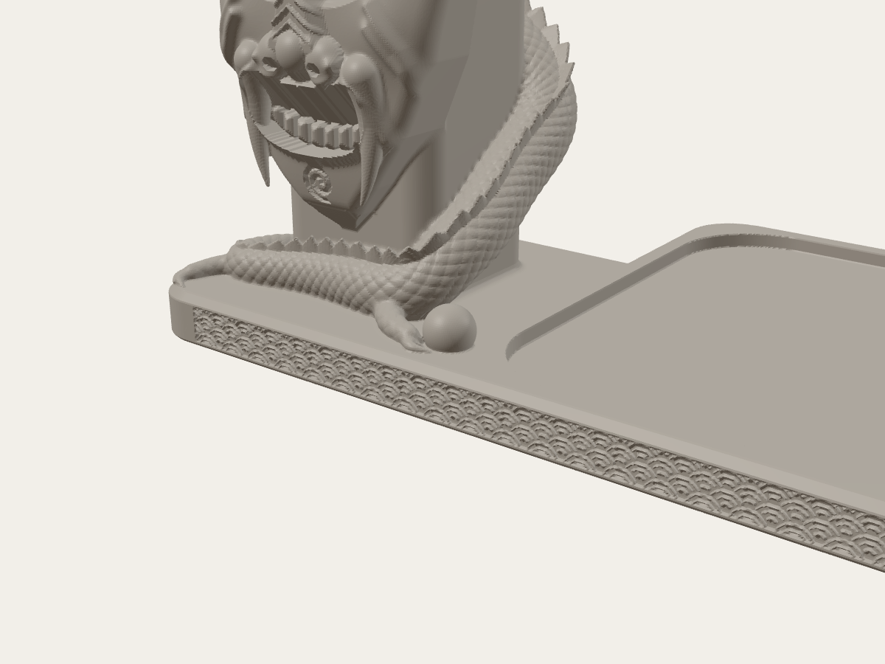
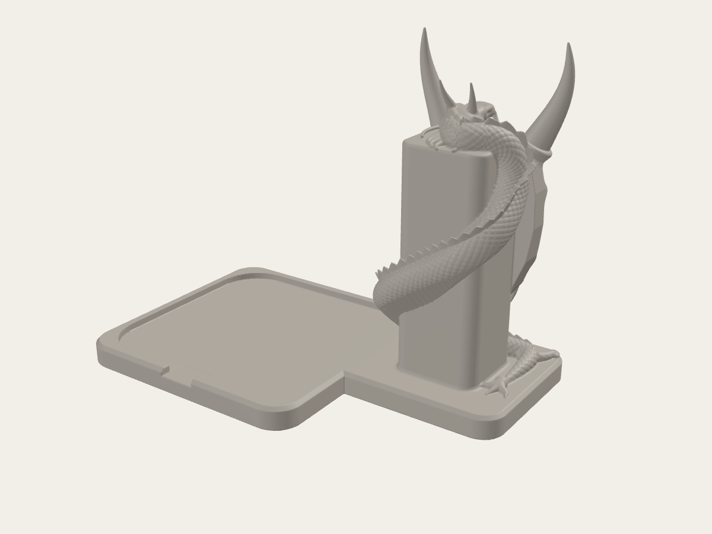

# Подставка под Яндекс Станцию Миди — «Они и дракон»

Подставка под колонку с Алисой в японском стиле: слева стоит стела с маской
они (рога в кольцах, спирали на лбу, оскал с клыками). Вокруг стелы
обвивается чешуйчатый дракон с гребнем: хвост лежит на основании, лапа
тянется к жемчужине, а голова с усами и рогами лежит на макушке маски.
Справа — место под колонку. Фасад основания покрыт волнами сэйгайха.

Готовый файл: [`stl/alisa_midi_oni_dragon_stand.stl`](stl/alisa_midi_oni_dragon_stand.stl)



| | |
|---|---|
|  |  |
|  |  |

---

## Габариты

| | |
|---|---|
| Вся подставка | **175 × 108 × 139 мм** (Ш × Г × В) |
| Колонка (Станция Миди) | 96 × 96 × 110 мм |
| Выступ вперёд за колонку | 6 мм |
| Выступ назад за колонку | 6 мм |
| Влево (стела с драконом) | 73 мм |
| Вправо за колонку | 6 мм |
| Высота основания под колонкой | 7 мм (колонка поднимается на 7 мм) |

Вперёд и назад подставка почти не выходит за колонку, вся декорация
вынесена влево. Рога стелы поднимаются выше колонки (139 против 117 мм),
так что с полкой над колонкой меньше 140 мм не поместится.

## Кабель

Сзади в бортике сделан вырез **16 мм** по центру, до самого дна посадочного
места. Бортик всего 3 мм, поэтому кабель USB-C идёт к разъёму свободно,
под ним ничего нет. Ни дракон, ни стела заднюю сторону колонки не
перекрывают.

> Точное положение разъёма на корпусе я в открытых характеристиках не нашёл —
> известно только, что USB-C сзади. Если у тебя он не по центру, проверь
> рулеткой и поменяй `CABLE_X` в начале скрипта (см. ниже). Но даже если
> вырез не совпадёт, кабель просто ляжет поверх бортика в 3 мм.

## Посадка колонки

Гнездо — скруглённый квадрат 98 × 98 мм (колонка + 1 мм с каждой стороны),
радиус углов 18 мм, глубина 3 мм. В него влезает и квадратный корпус
96 × 96 со скруглением, и цилиндр Ø96, так что форма низа колонки
значения не имеет. Если колонка болтается или не входит — поменяй
`SPK_CLEAR`.

## Печать

Деталь цельная, печатается **как лежит, основанием на стол, без поддержек**.

Скрипт проверяет это сам: идёт по слоям сверху вниз и под всё, что
нависает круче 45°, подкладывает 45-градусный клин (так получены, например,
скосы над глазами маски и под подбородком). После этого остаётся около
13 мм³ в виде одиночных пикселей чешуи — слайсер их не заметит.

Рекомендации (PLA, сопло 0.4):

- слой **0.12–0.16 мм** — на маске много мелких канавок и спиралей,
  при 0.2 они станут ступенчатыми;
- 3 стенки, заполнение 10–15 %. Стела массивная, плотное заполнение тут
  ничего не даёт, кроме веса и времени;
- поддержки **выключить**;
- брим не нужен: основание 175 × 108 мм плоское и широкое;
- влезает на стол от 180 × 180 мм.

Объём модели 309 см³ (это если печатать сплошной); с заполнением 15 %
реальный расход заметно меньше — точную цифру покажет слайсер.

## Покраска (по референсам)

- маска — серо-голубая с патиной, линия над бровями и кольца рогов
  золотые, рога от чёрного к золоту, глаза и рот внутри чёрные (как на первом
  фото);
- дракон — красный с тёмной обводкой чешуи, гребень и брюхо золотые (третье
  фото), жемчужина — золото;
- волны на основании — сухая кисть по тёмному фону.

Если есть AMS, можно наоборот печатать основание тёмным, а стелу
светлым пластиком, сменив цвет на высоте ~10 мм (верх основания).

## Как поменять размеры

Модель полностью генерируется скриптом [`tools/build_stand.py`](tools/build_stand.py),
все размеры — в начале файла:

| Параметр | Что это | Сейчас |
|---|---|---|
| `SPK` | сторона колонки | 96 |
| `SPK_CLEAR` | зазор вокруг колонки, на сторону | 1.0 |
| `POCKET_R`, `POCKET_DEPTH` | скругление и глубина гнезда | 18, 3 |
| `HP` | высота основания | 10 |
| `CABLE_X`, `CABLE_W` | положение и ширина выреза под кабель | 0, 16 |
| `ST_TOP` | высота стелы | 104 |

```
pip install numpy scipy scikit-image trimesh fast-simplification
python3 tools/build_stand.py              # финальная, воксель 0.3 мм, ~1–2 мин
python3 tools/build_stand.py --res 0.6    # быстрый черновик, пара секунд
```

Скрипт печатает отчёт: сколько материала добавлено под нависания и
что ещё осталось висеть в воздухе (с координатами).

### Как это устроено

Вся подставка — одно поле расстояний (SDF), которое просчитывается на
воксельной сетке и превращается в сетку треугольников через marching cubes.
Поэтому маска, тело дракона и основание сливаются с плавными переходами,
а не склеены булевыми операциями.

- **Маска** — рельеф (карта высот) поверх пластины по силуэту маски.
  Пластина шире стелы на 8 мм с каждой стороны, поэтому читается как маска,
  висящая на столбе. Клыки и рога — отдельные объёмные конусы.
- **Дракон** — трубка переменной толщины вдоль сплайна вокруг стелы.
  Чешуя — две смещённые решётки бугорков в координатах «вдоль тела / вокруг
  тела», гребень — пилообразный плавник. Плавник всегда стоит вертикально,
  поэтому печатается без поддержек.
- **Голова, лапы, жемчужина** — композиция эллипсоидов и тонких трубок.
  Всё тонкое (усы, грива, пальцы) лежит на поверхности, а не висит.
  Рот — V-образная канавка под 45°, чтобы не было моста.
- **Волны сэйгайха** на фасаде — дуги концентрических окружностей,
  вырезанные на 0.55 мм.

Готовая сетка: замкнутая (watertight), прорежена с 1.6 млн до 600 тыс.
треугольников. На плоскостях это ничего не меняет, а мелкие детали
сохраняются.
