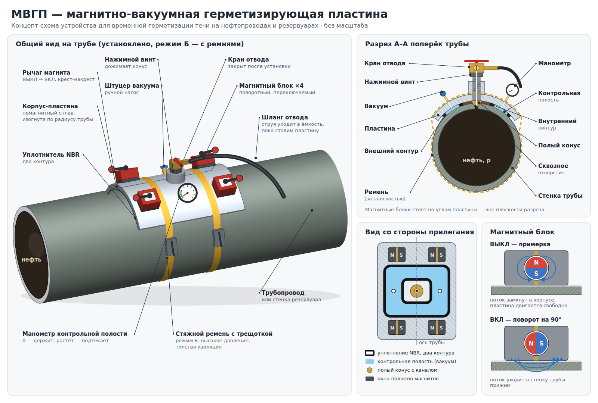

# МВГП — магнитно-вакуумная герметизирующая пластина

Концепт устройства для временной герметизации сквозных течей на нефтепроводах
и резервуарах.



- `concept.svg` / `concept.png` — концепт-схема: общий вид на трубе, разрез
  поперёк трубы, вид со стороны прилегания, принцип переключаемого магнита.
- `tools/draw_concept.py` — генератор схемы. Общий вид — настоящая 3D-сцена в
  ортогональной проекции, поэтому детали остаются в пропорции друг к другу.

```
python3 tools/draw_concept.py   # пересобрать concept.svg
```

Схема без масштаба: размеры и число магнитных блоков будут уточнены расчётом.

## Презентация

`presentation/MVGP_presentation.pptx` — презентация в стиле ДВФУ на 18 слайдов;
текст доклада записан в заметках к слайдам. Пересборка:

```
cd presentation && NODE_PATH=<путь к node_modules с pptxgenjs> node build_deck.js
```
