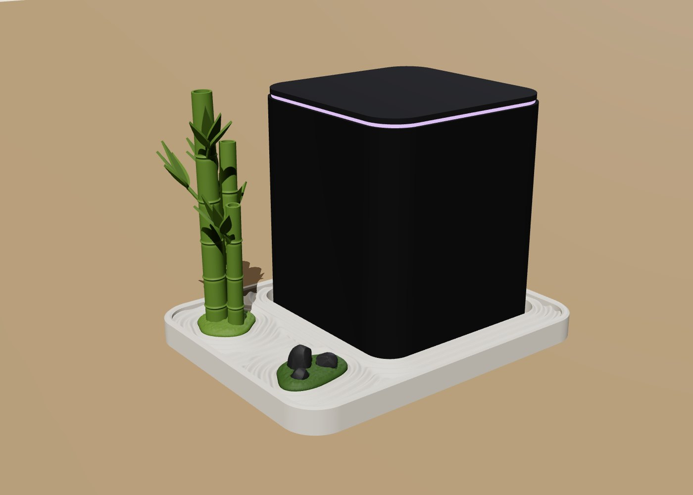
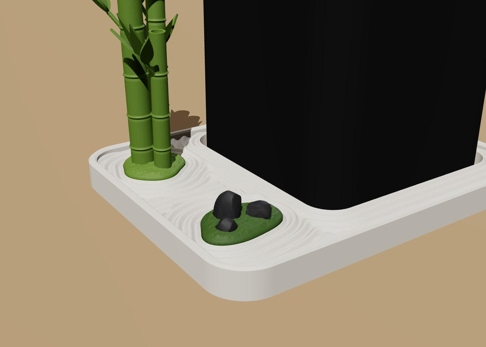
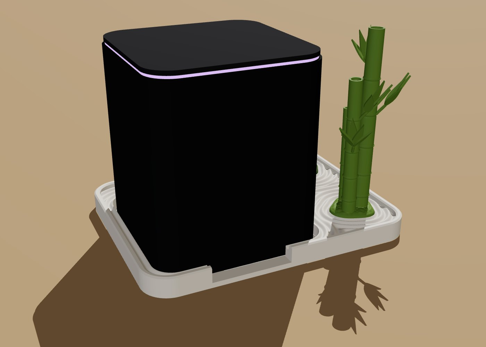
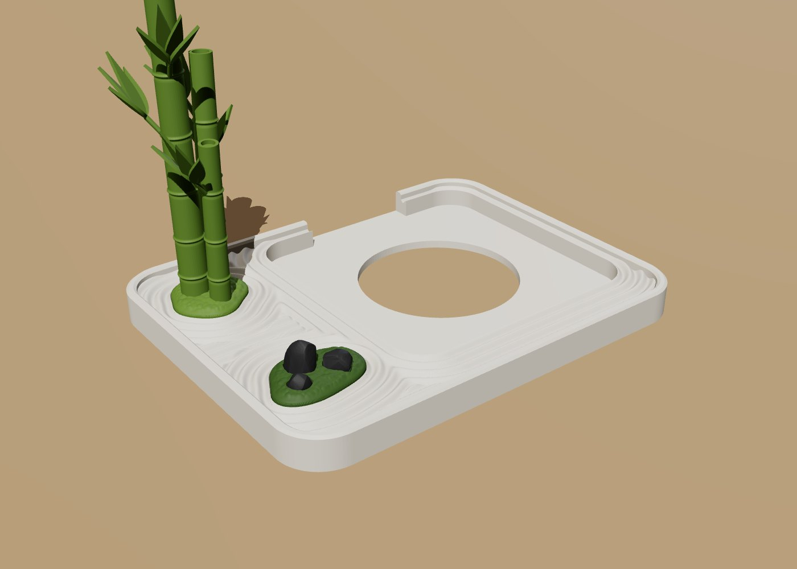
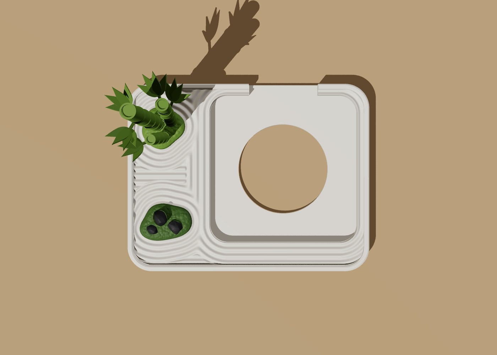

# Сад камней — подставка под Яндекс Станцию Миди



Станция становится главным камнем в японском саду камней (карэсансуй).
Вокруг неё «граблями» разведены круги по гравию. Слева два островка мха:
на одном три камня (классическая композиция «сандзон» из большого и двух
малых), на другом маленькая бамбуковая роща. Где круги заканчиваются,
гравий расчерчен прямыми линиями, как в Рёан-дзи.

Подставка компактная: 160 × 124 мм. Справа и сзади она выступает из-под
станции меньше чем на сантиметр, спереди на 2 см, весь сад помещается в
полосе 5,5 см слева. Высота основания 12 мм, бамбук на 5 мм выше станции.

| | |
|---|---|
|  |  |
|  |  |

## Детали

| Файл | Что это | Габариты, мм | Цвет |
|---|---|---|---|
| `stl/base.stl` | основание-«гравий» с гнездом под станцию | 160 × 124 × 12 | белый или светло-серый |
| `stl/moss_stones.stl` | моховой островок под камни | 34 × 24 × 9 | тёмно-зелёный |
| `stl/stones.stl` | три камня | до 14 в высоту | чёрный или графит, в тон станции |
| `stl/bamboo.stl` | бамбук вместе со своим моховым островком | 47 × 50 × 113 | зелёный |
| `stl/fit_test.stl` | рамка для примерки гнезда | 107 × 107 × 4 | любой |

Детали разделены по цветам, поэтому трёхцветный сад печатается на A1
без AMS: каждая деталь своим пластиком. В один цвет тоже смотрится,
например всё белое, как гипсовый макет.

## Печать (Bambu Lab A1, PLA)

Все STL уже лежат так, как их печатать: плоской стороной на столе.
**Поддержки не нужны ни одной детали.** Нависаний круче 45° нет нигде,
кроме узлов бамбука (выступ 0,45 мм) и потолка отверстия под штырь
(мост 6,5 мм).

1. **Сначала `fit_test`** (0,2 мм, минут 10–15). Поставь станцию в рамку:
   она должна входить свободно, с зазором около миллиметра, и не
   упираться углами. Если не входит или болтается, скажи мне, на сколько,
   и я поправлю гнездо. Или поправь сам, см. «Что можно подогнать».
2. **`base`**: слой 0,16 мм (круги на гравии будут глаже, чем на 0,2),
   3 стенки, заполнение 15 % gyroid.
3. **`bamboo`**: слой 0,12 мм, кайма (brim) 5 мм. Деталь высокая и
   тонкая, а у A1 ездит стол, поэтому кайма помогает ей не раскачиваться.
4. **`moss_stones`** и **`stones`**: слой 0,12 мм.

## Сборка

1. Островок с бамбуком вставляется в заднее левое гнездо и садится на
   штырь. Островок под камни вставляется в переднее гнездо.
2. Камни ставятся в свои лунки во мху, каждая лунка по форме своего
   камня: большой сзади, средний справа, маленький спереди слева.
3. Всё держится и так, но капля клея в каждое гнездо не помешает.
4. Станция ставится в гнездо, кабель уходит назад через вырез шириной
   46 мм и дальше вверх. Кнопка микрофонов сзади остаётся доступной.

Под станцией в полу гнезда отверстие Ø60 мм. Если снизу у станции есть
излучатель, он не будет заглушён. Заодно, скорее всего, останется
доступной кнопка сброса на дне.

## Что можно подогнать

Модель генерируется скриптом `tools/make_stand.py`, все размеры в начале
файла:

- `CLEARANCE` — зазор между станцией и стенкой гнезда, по умолчанию 1,25 мм
  на сторону;
- `POCKET_R` — радиус скругления углов гнезда. Производитель его не
  публикует, взят 12 мм. Если у станции углы круглее, в углах будет
  небольшой просвет, а если острее, станция не войдёт. Для проверки и
  нужна `fit_test`;
- `NOTCH_W` — ширина выреза под кабель;
- `W`, `D` — размер подставки, `STALKS` — высота и наклон бамбука.

```
pip install numpy shapely manifold3d
python3 tools/make_stand.py          # перезапишет stl/
```

Размеры станции (96 × 96 × 110 мм, USB-C и кнопка микрофонов сзади)
взяты из характеристик и обзоров Станции Миди.
