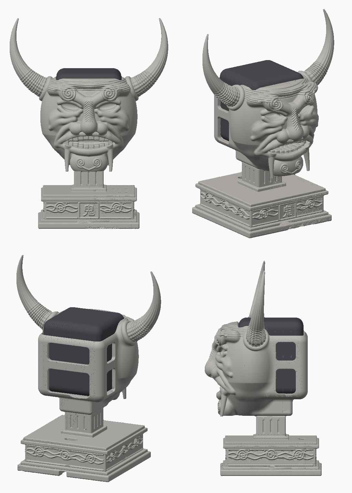

# Подставка «Они» для Яндекс Станции Миди

Голова демона-они (маска ханнья) с рогами на каменном постаменте с волнами и
иероглифом **鬼** («они»). Колонка вставляется в голову сверху, верх с
сенсорной панелью остаётся открытым.



Модель построена кодом (`tools/`), а не вылеплена вручную. Форма повторяет
референс: рога с кольцами, спирали на бровях и подбородке, нос с «ёлочкой»,
складки на щеках, зубы, клыки, решётка на затылке, ступенчатый постамент.
Мелкая резьба проще, чем в скульптуре из ZBrush.

## Посадка под колонку

| | |
|---|---|
| Станция Миди (YNDX-00054) | 96 × 96 × 110 мм, куб со скруглёнными углами |
| Гнездо в голове | **99 × 99 мм**, зазор 1.5 мм на сторону, радиус угла 8 мм |
| Высота стенок | 92 мм от дна. Верхние 18 мм колонки торчат, панель свободна |
| Дно гнезда | сплошное, 6 мм |

Радиус угла в гнезде намеренно меньше, чем у колонки: так она входит при
любом реальном скруглении. Скрипт сборки проверяет, что стенки головы
не заходят в гнездо (сейчас 0.00 мм).

**Перед печатью измерь свою колонку штангенциркулем.** Размеры взяты из
характеристик производителя. Если отличаются, поменяй `SPEAKER_W/D/H` или
`CLEARANCE` в `tools/params.py` и пересобери.

Колонка ставится **дисплеем к лицу, разъёмом USB-C назад**. Дисплей
закрыт маской, свет пробивается через прорези глаз и рта. Через эти
прорези и через окна сзади и по бокам выходит звук.

### Кабель

USB-C выходит назад, в нижнее окно затылка (оно начинается в 3 мм от дна,
так что разъём на любой высоте не упрётся). Дальше кабель идёт вниз за шеей
в щель 20 × 11 мм в постаменте и по пазу 13 × 8 мм в дне выходит сзади.
Протягивать с конца адаптера: штекер USB-A/USB-C проходит в щель.

## Детали

| Файл | Размер, мм | Кол-во | Как ставить на стол |
|---|---|---|---|
| `stl/head.stl` | 148 × 153 × 136 | 1 | как в файле: гнездом шеи вниз, лицом вперёд |
| `stl/base.stl` | 150 × 150 × 106 | 1 | как в файле: дном вниз |
| `stl/horn_right.stl` | 95 × 31 × 77 | 1 | как в файле: плоским корнем вниз |
| `stl/horn_left.stl` | 95 × 31 × 77 | 1 | то же, зеркальный |
| `stl/horn_pin.stl` | Ø10 × 23 | **2** | стоя |
| `stl/assembly_preview.stl` | 235 × 174 × 308 | — | только для просмотра, не печатать |

Все печатные детали — замкнутые сетки (watertight). STL уже повёрнуты так, как их печатать,
и лежат на z = 0. Каждая деталь влезает на стол 180 × 180 (Bambu A1 mini и
больше).

Высота с рогами 308 мм. Верх колонки на высоте 228 мм, рога выше на 80 мм.

## Печать

- **Пластик:** PLA или PETG. Сопло 0.4, слой 0.12–0.16 для головы и рогов
  (резьба мелкая), 0.2 для постамента.
- **Заполнение:** 15% гироид, 3–4 стенки. Постамент можно оставить тяжёлым
  (20–25%): чем тяжелее низ, тем устойчивее.
- **Поддержки:**
  - голова — древовидные (tree), «только от стола» почти не хватит: нужны
    под подбородком, клыками, бровями, носом и под втулками рогов. Внутри
    гнезда поддержки не нужны, стенки вертикальные. Потолок гнезда шеи —
    мост 35 мм, держится без поддержки;
  - рога — древовидные под изгибом;
  - постамент — только под карманом для груза в дне (мост Ø61 мм), «только
    от стола».
- **Ориентировочно** (3 стенки, без поддержек): голова ~280 г, постамент ~360 г
  при 20%, рога по ~16 г. Всего около 0.7 кг PLA плюс поддержки.

## Сборка

1. Шея постамента (квадратный шип 34 × 34 × 20 мм) входит в гнездо под
   головой, зазор 0.3 мм на сторону. Квадрат не даёт голове провернуться.
   Можно капнуть клея или оставить разборным.
2. Рога: штифт `horn_pin` до упора в отверстие втулки на голове, рог надеть
   сверху. Отверстия Ø10.4 × 12 мм в обеих деталях, штифт Ø9.9 × 23. На
   клей (суперклей, эпоксидка).
3. **Груз (по желанию).** В дне постамента карман Ø61 × 9 мм: туда можно
   вклеить стальные шайбы или гайки. Колонка весит 0.9 кг и стоит высоко,
   с грузом подставку сложнее опрокинуть.
4. Протянуть кабель (см. выше), вставить колонку сверху.

## Пересборка

```
pip install numpy scipy scikit-image trimesh fast-simplification pymeshfix pillow
python3 tools/build.py           # финальное качество, ~10 мин
python3 tools/build.py --draft   # быстрый черновик в stl_draft/, ~1 мин
```

- `tools/params.py` — все размеры посадки (колонка, зазоры, стенки, шип, штифты)
- `tools/head.py` — голова: гнездо, решётка, маска, черты лица
- `tools/horn.py` — рога и штифты
- `tools/base.py` — постамент, волны, панель с иероглифом (шрифт IPAGothic)
- `tools/sdf.py` — примитивы SDF и построение сетки (marching cubes)
- `tools/render.py` — превью в `previews/`
