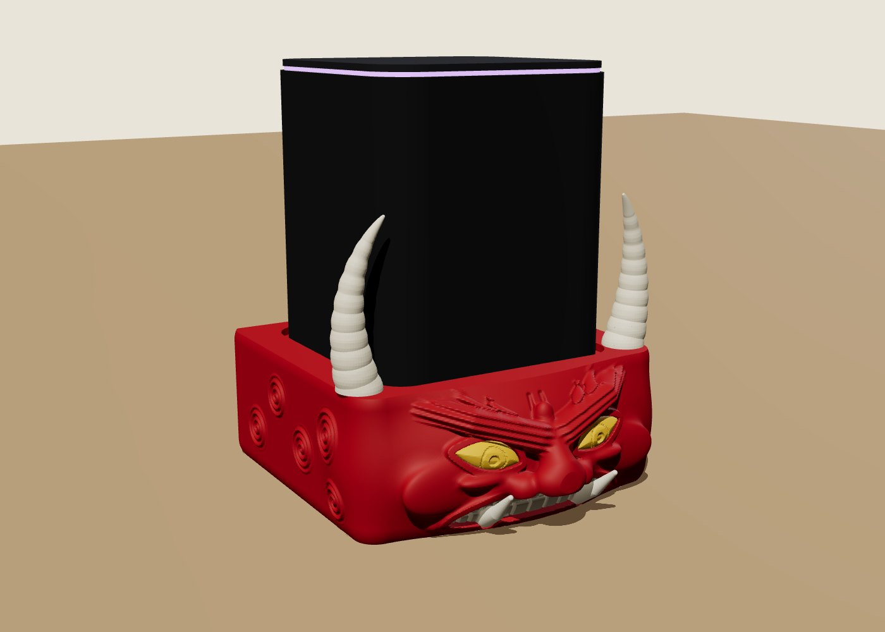
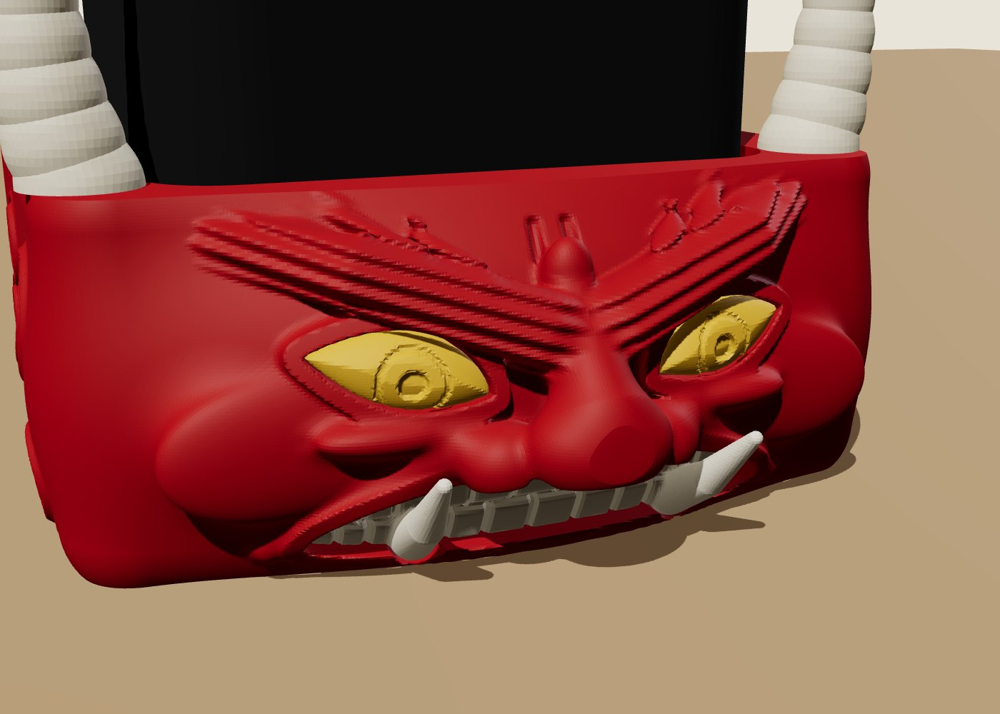
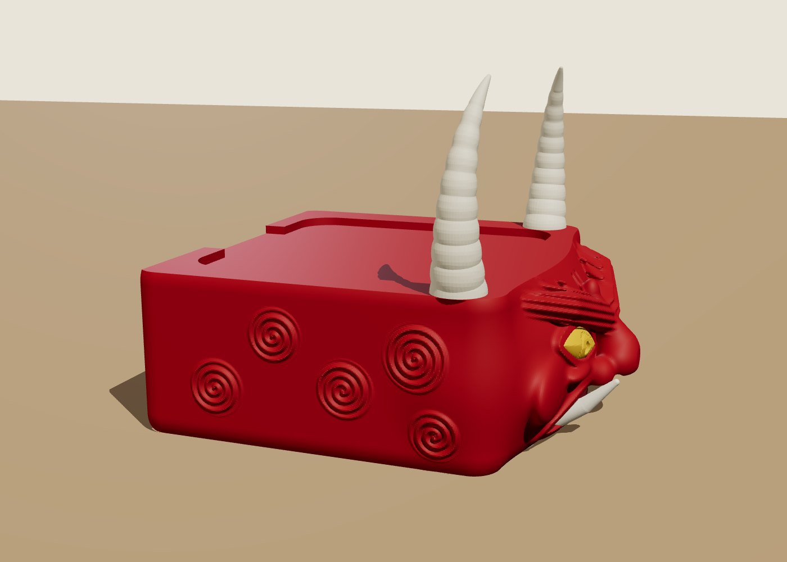
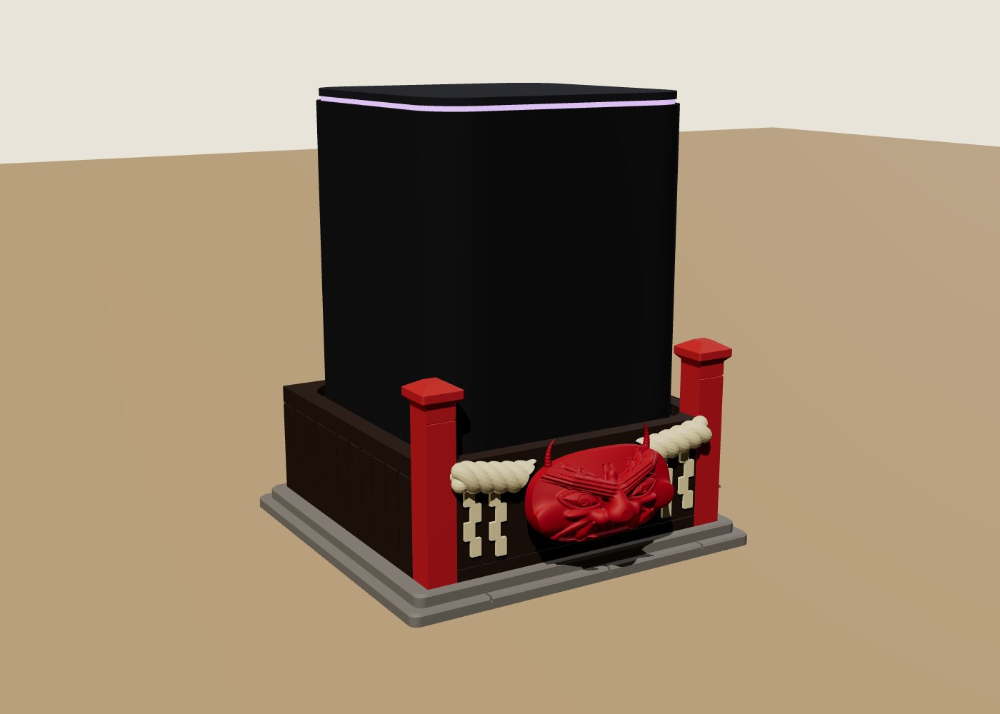
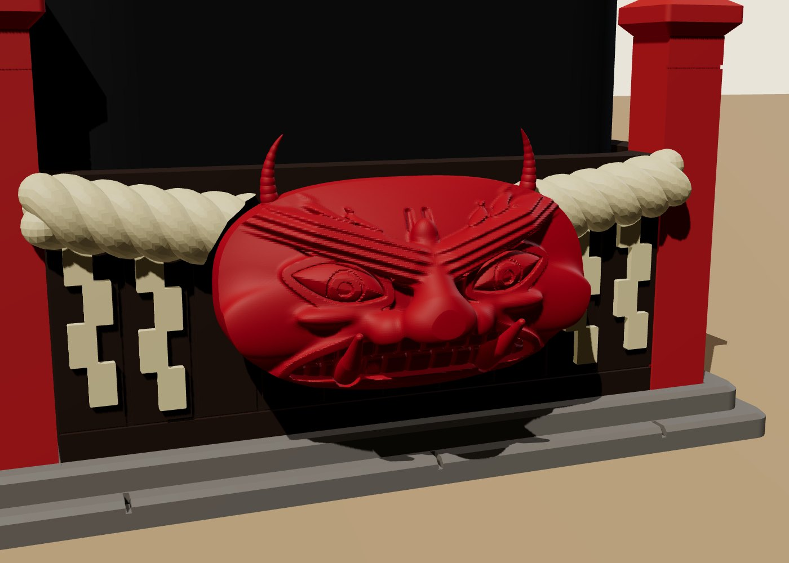

# Они — две подставки под Яндекс Станцию Миди

Два варианта на одну тему: классический злой красный Они. Лицо у обоих
одно и то же, вылепленное в коде (`tools/oni_face.py`): брови злой
«галкой» с языками пламени, раскосые жёлтые глаза, нос картошкой, сжатые
зубы и два клыка, торчащие вперёд.

## Вариант 1 — голова Они



| | |
|---|---|
|  |  |

Подставка — это сама голова: 134 × 144 мм, высота 52 мм. Станция стоит у
неё на макушке в гнезде глубиной 3 мм, по бокам поднимаются рога. На
висках завитки волос, сзади вырез под кабель.

| Файл `stl/head/` | Цвет | Как печатать |
|---|---|---|
| `head.stl` | красный | лёжа на затылке, лицом вверх |
| `eyes.stl` | жёлтый | плоской стороной вниз |
| `teeth.stl` | слоновая кость | плоской стороной вниз |
| `horns.stl` | слоновая кость | основанием вниз |
| `pins.stl` | любой | два штифта, держат рога |
| `fit_test.stl` | любой | рамка для примерки гнезда |

Глаза и зубы вставляются в лицо спереди. Рога надеваются на штифты,
штифты вставляются в отверстия на макушке. Поддержки не нужны: при печати
лёжа нависает только край гнезда, а это всего 3 мм, A1 такое вытягивает.

## Вариант 2 — святилище с маской





Каменный цоколь 130 × 124 мм, на нём деревянный подиум высотой 46 мм.
Спереди два красных столба, между ними верёвка симэнава с бумажными
зигзагами сидэ, а на верёвке висит маска Они.

| Файл `stl/shrine/` | Цвет | Как печатать |
|---|---|---|
| `plinth.stl` | серый (камень) | как лежит |
| `podium.stl` | тёмное дерево: коричневый или чёрный | как лежит |
| `posts.stl` | киноварно-красный | стоя |
| `rope.stl` | соломенный или слоновая кость | плоской спиной вниз, две половинки |
| `mask.stl` | красный | спиной вниз, **с поддержками** под рога |
| `fit_test.stl` | любой | рамка для примерки гнезда |

Подиум ставится в углубление цоколя, столбы в пазы на передних углах.
Половинки верёвки и маска приклеиваются к передней стенке. Рога и клыки
маски можно подкрасить белым.

## Общее

- Гнездо под станцию: 96 × 96 мм плюс 1,25 мм зазора на сторону, углы
  R12. Перед большой печатью проверь посадку на `fit_test`.
- Сзади у обоих вариантов вырез 46 мм под кабель: штекер входит прямо,
  кабель уходит вверх.
- Модели генерируются скриптами:

```
pip install numpy shapely scikit-image manifold3d
python3 tools/make_head.py     # -> stl/head/
python3 tools/make_shrine.py   # -> stl/shrine/
```
